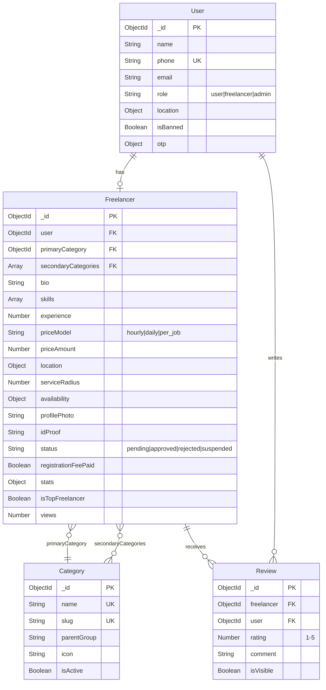

# LocalLink 🗺️
> Connect local users with verified nearby freelancers for daily life services.

---

## 📁 Folder Structure

```
locallink/
├── backend/
│   ├── config/          # DB connection
│   ├── controllers/     # Route handlers
│   ├── middleware/      # Auth, upload, error
│   ├── models/          # Mongoose schemas
│   ├── routes/          # Express routers
│   ├── seeds/           # DB seed scripts
│   ├── services/        # OTP, cron jobs
│   ├── uploads/         # File storage
│   ├── server.js        # Entry point
│   ├── Dockerfile
│   └── .env.example
├── frontend/
│   ├── src/
│   │   ├── components/  # Reusable UI
│   │   ├── context/     # React context
│   │   ├── pages/       # Route pages
│   │   └── utils/       # Helpers, API
│   ├── Dockerfile
│   ├── nginx.conf
│   └── vite.config.js
└── docker-compose.yml
```

---

## 🚀 Setup (Local Development)

### Prerequisites
- Node.js 18+
- MongoDB 6+

### Step 1: Clone & configure

```bash
git clone <repo>
cd locallink

# Backend config
cp backend/.env.example backend/.env
# Edit backend/.env — set MONGO_URI, JWT_SECRET, etc.
```

### Step 2: Install & start backend

```bash
cd backend
npm install
# Seed categories
node seeds/index.js
# Start dev server
npm run dev
```

### Step 3: Install & start frontend

```bash
cd ../frontend
npm install
npm run dev
```

Open: http://localhost:5173

### Default Mock OTP
When `MOCK_OTP=true` in `.env`, use code: **123456**

### Admin Login
```
POST /api/auth/admin-login
{ "phone": "+919999999999", "adminSecret": "locallink_admin_2024" }
```

---

## 🐳 Docker Deployment

```bash
# Build & start all services
docker-compose up --build -d

# View logs
docker-compose logs -f

# Seed database (first run)
docker-compose exec backend node seeds/index.js

# Stop
docker-compose down
```

Access at: http://localhost

---

## ☁️ Production Deployment (VPS/AWS)

1. Copy project to server
2. Set production env vars:
```bash
export JWT_SECRET=your-strong-secret-here
export ADMIN_SECRET=your-admin-secret
export FRONTEND_URL=https://yourdomain.com
export MOCK_OTP=false    # Set Twilio credentials for real OTP
```
3. Use Nginx + SSL (Certbot) in front of Docker

---

## 📘 API Documentation

### Base URL: `/api`

---

### Auth

| Method | Endpoint | Description | Auth |
|--------|----------|-------------|------|
| POST | `/auth/send-otp` | Send OTP to phone | Public |
| POST | `/auth/verify-otp` | Verify OTP & get token | Public |
| PUT | `/auth/complete-profile` | Save name/role | 🔒 |
| GET | `/auth/me` | Get current user | 🔒 |
| POST | `/auth/admin-login` | Admin login (secret) | Public |

**Send OTP**
```json
POST /auth/send-otp
{ "phone": "+919876543210" }
```

**Verify OTP**
```json
POST /auth/verify-otp
{ "phone": "+919876543210", "otp": "123456" }
```
Response: `{ token, user: { id, name, phone, role, isNewUser } }`

---

### Freelancers

| Method | Endpoint | Description | Auth |
|--------|----------|-------------|------|
| GET | `/freelancers/search` | Search freelancers | Public |
| GET | `/freelancers/top` | Get top freelancers | Public |
| GET | `/freelancers/:id` | Get profile | Public |
| GET | `/freelancers/:id/contact` | Get masked phone | 🔒 |
| POST | `/freelancers/register` | Register as freelancer | 🔒 |
| GET | `/freelancers/my-profile` | Own profile | 🔒 Freelancer |
| PUT | `/freelancers/my-profile` | Update profile | 🔒 Freelancer |

**Search Query Params:**
- `category` - Category ID
- `lat`, `lng` - Coordinates for geo search
- `radius` - KM radius (default: 20)
- `minPrice`, `maxPrice`
- `minRating`
- `sortBy` - `ranking` | `rating` | `price_asc` | `price_desc`
- `page`, `limit`

---

### Categories

| Method | Endpoint | Description |
|--------|----------|-------------|
| GET | `/categories` | All active categories |
| GET | `/categories/grouped` | Grouped by parent |

---

### Reviews

| Method | Endpoint | Description | Auth |
|--------|----------|-------------|------|
| POST | `/reviews` | Add review | 🔒 User |
| GET | `/reviews/freelancer/:id` | Get freelancer reviews | Public |

---

### Payments (Mock)

| Method | Endpoint | Description | Auth |
|--------|----------|-------------|------|
| POST | `/payments/initiate` | Start payment | 🔒 |
| POST | `/payments/verify` | Confirm payment | 🔒 |

---

### Admin (All require 🔒 Admin role)

| Method | Endpoint | Description |
|--------|----------|-------------|
| GET | `/admin/stats` | Dashboard stats |
| GET | `/admin/users` | List users |
| PUT | `/admin/users/:id/ban` | Ban user |
| PUT | `/admin/users/:id/unban` | Unban user |
| GET | `/admin/freelancers` | All freelancers |
| GET | `/admin/freelancers/pending` | Pending list |
| PUT | `/admin/freelancers/:id/approve` | Approve |
| PUT | `/admin/freelancers/:id/reject` | Reject |

---

## 🗄️ Database Schema



---

## 🏆 Ranking Algorithm

```
Score = (avgRating/5 × 10 × 0.5) + (min(jobs/50,1) × 10 × 0.3) + (responseSpeed × 0.2)
Max score = 10.0
Updated weekly by cron job every Monday at midnight
```

---

## 🔒 Security Features

- JWT + Phone OTP auth
- Rate limiting (200 req/15min global, 20 auth/15min)
- Helmet.js security headers  
- Input validation & sanitization
- File type/size validation
- Protected routes with role-based access
- Phone number masking via relay system
- Admin secret for panel access

---

## 📱 User Roles

| Role | Access |
|------|--------|
| `user` | Browse, search, contact, review freelancers |
| `freelancer` | Register, manage own profile, view stats |
| `admin` | Approve/reject/ban, view all data, manage categories |
